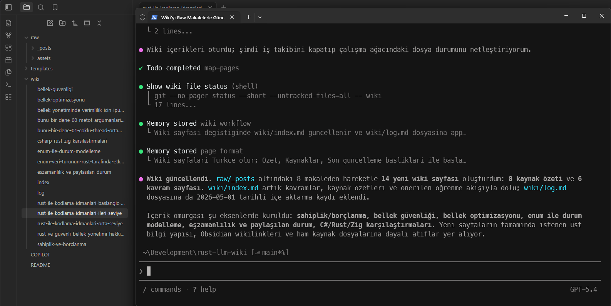
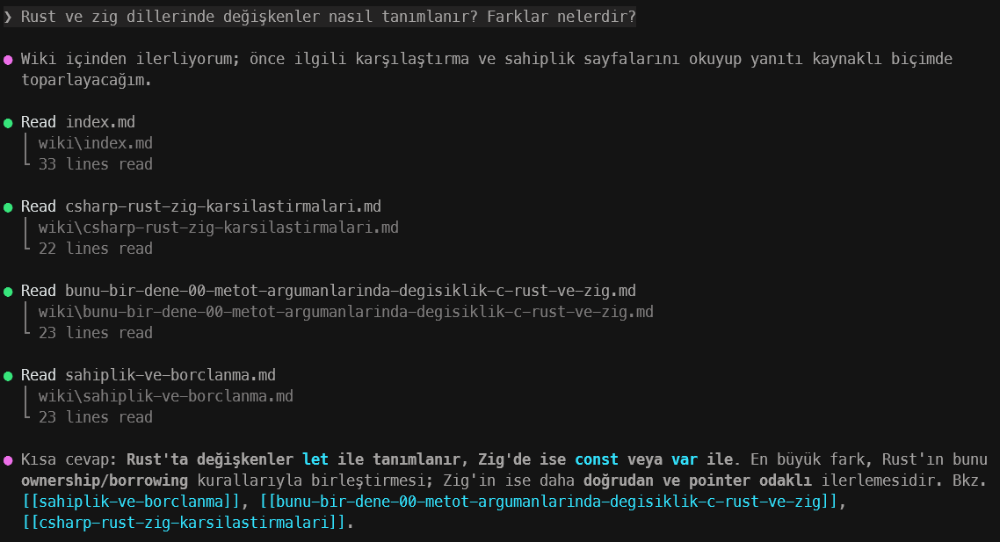
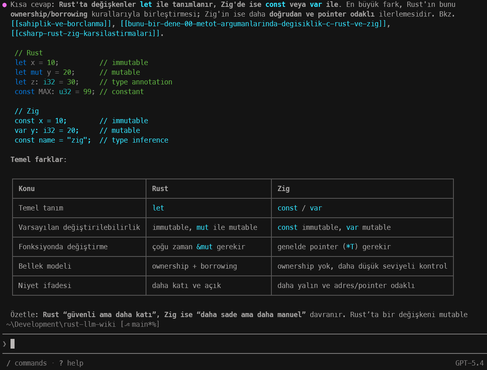
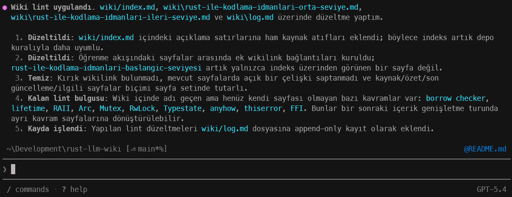
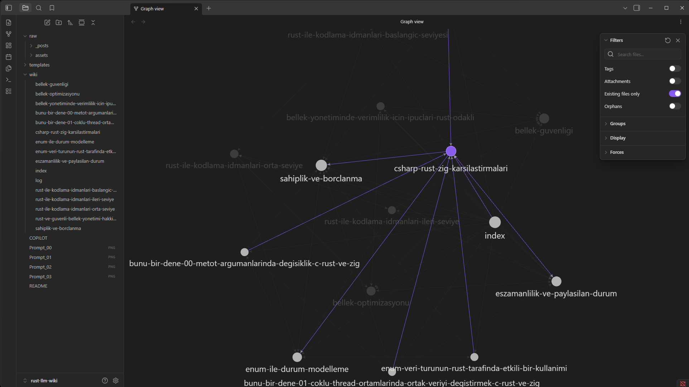

# rust-llm-wiki

Andrej Karpathy'nin LLM Wiki önerisini Copilot ile denediğim çalışma alanı.

Bu çalışmada Obsidian ve Copilot CLI kullanılmakta. Karpathy kendi LLM wiki örneğinde doğal olarak Claude için hazırlanmış bir markdown dosyası ve CLI aracını kullanmakta. Benzer bir çalışmayı Microsoft Copilot ile denemeye çalışıyorum.

## Amaç

Rust ile ilgili yazdığım blog yazılarını baz aldığım minik bir LLM wiki oluşturmak. Doküman içerikleri ve anlamsal ilişkileri wiki olarak özetletmek. Copilot komut satırını kullanarak bu arşive sorular sorabilmek. **RAG** kurgusunun **LLM Wiki** olarak işletilmesini sağlamak.

## Hazırlıklar

Kaynaklardan hareketle üç klasör oluşturdum. 

```text
/raw -- Tüm makale içerikleri (görselleri ile birlikte) burada yapılandırılıyor
/templates -- Şablonlar gerekliyorsa burada olacak
/wiki -- Hem indekslenmiş wiki içerikleri hem de güncelleme logları burada tutuluyor
COPILOT.md -- Normalda CLAUDE.md olarak yazılan talimatların yer aldığı dosya
```

## Denemeler

Daha sonra Copilot CLI arabiriminden `\init` komutunu kullanarak `.github\copilot-instructions.md` dosyasını oluşturdum. Copilot özellikle `COPILOT.md` içeriğine bakarak gerekli düzenlemeleri yaptı. Ardından şu promptu kullandım.

```text
raw klasöründeki makaleleri oku ve wiki'yi güncelle.
```



Sonrasında şu soruyu sordum.

```text
Rust ve zig dillerinde değişkenler nasıl tanımlanır? Farklar nelerdir?
```

Buradaki dikkat edilmesi gereken nokta ajanın doğrudan makaleleri araştırmak yerine öncelikle wiki içeriğine gitmesidir.



Hatta kendince bir özeti de buradaki içeriklere göre çıkartmış durumda.



Tabii burada ajanın raw içerisindeki bilgilere bakarak bir sonuç ürettiğini ve oradaki bilgilerin doğruluğuna göre bu sonuçların değerlendirilmesi gerektiğini unutmayalım.

`raw` klasörüne yeni bir içerik eklediğimizde de `wiki` içeriğini güncelletebiliriz. Bununla birlikte `wiki` içeriğinin sağlıklık kalması için `linting` işlemi de uygulatabiliriz.

```text
Wiki içeriklerinde lint işlemini uygula.
```

Buna göre `Copilot` wiki içeriklerindeki bağlantıları, formatlamayı kontrol edecek ve gerekli düzeltmeleri yapacaktır.



Bu kullanımda işin güzel yanı içerikteki ilişkilerin **Obsidian** üzerinden grafiksel olarak gösterimidir. Ortada bir vektör veritabanı, maliyetli rag hattı, embedding işlemleri vs olmadığına dikkat edelim.



## Güncellemeler

Bir süre sonra `raw` klasörüne yeni dokümanlar ekledim ve `Copilot`'a aşağıdaki prompt' u vererek wiki'yi güncellemesini istedim.

```text
Yeni blog post girdileri ekledim. Buna göre wiki'yi günceller misin?
```

Bu yeni talebe istinaden öncelike `COPILOT.md` dosyasını okuyarak işe başlaması daha önceden belirlenen talimatlara bağlı kalarak hareket ettiğini ispat eder nitelikteydi. Tabii var olan dokümanlar ile yeni eklenen dokümanlar arasında da bir takım ilişkiler kurulması gerekiyor. Bu yüzden hem yeni `wiki` içerikleri oluşturduğunu hem de var olan `wiki` lerin bazılarında düzenlemeler yaptığını fark ettim.

![[Runtime_05.png]]

Eklediğim blog yazıları bana ait olduğundan azçok içeriklerine de hakimim. Bu nedenle oluşan çalışmayı sorgulamak adına birkaç örnek prompt denedim.

```text
C# dilinde interface türleri ile soyutlamalar yapılabiliyor. Rust nesne yönelimli bir dil olarak tasarlanmamış olsa da soyutlamaları destekliyor mu? Destekliyorsa örnek bir kod parçası var mı?
```

![[Runtime_06.png]]

devamı da var...

![[Runtime_07.png]]

etkileyici. Burada şu an için tek sorun örneğin doğru ama struct, trait vb enstrüman isimlendirmelerinin Türkçe yapılmış olması. Normalde blog içerisinde bu örnekler İngilizce isimlendirmelerden oluşuyor. 

> **Gözlem:** Session içerisinde `Copilot` baktığı bazı tekrarlı işleri belleğe kayıt etmek istediğini belirtti. Bunu kabul ettikten sonra Wiki sayfaları üzerinden cevaplama süreleri de oldukça hızlandı.

Çalışma sırasında fark ettiğim bir şey de öksüz dokümanlar *(orphans docs)* Bunu *obsidian*'ın **Graph View** sekmesinde fark ettim. `Raw` içerisinde değerlendirilmiş ama hiçbir başka kavramla ilişkilendirilememiş dosyalar vardı.

![[Runtime_08.png]]

Bunun üzerine Copilot'a aşağıdaki prompt'u girerek wiki içeriğini tekrardan değerlendirmesini istedim.

```text
 Herhangi bir şekilde işlenmemiş sayfaları (orphan docs) tespit edip tekrardan değerlendirebilir misin? Bu yeni 
  değerlendirmeye göre wiki'yi de güncelleyelim.
```

![[Runtime_09.png]]

Bu pratiklerle `wiki` içeriğini pekala daha kaliteli hale getirmek mümkün olabilir.
## Görüşler

Diyelim ki yeni bir programlama dilini öğrenmeye çalışıyorum. Bu amaçlar özet notlarım, örnek kod dosyalarım, grafik çizimleri, çeşitli referans pdf'lerim var. Tüm bu öğretim yolculuğunda LLM odaklı bir wiki'ye ihtiyacım varsa pekala işime yarar. Peki ya bir kurum içerisindeki binlerce analiz dokümanı, wireframe, kod parçası bu senaryo özelinde değerlendirilebilir mi? Buraya bir soru işareti bırakmak yerinde olacaktır. Bana kalırsa;

- Bireysel ölçekte değerlendirilebilecek çalışmalar için ideal bir yaklaşım. Bir **RAG(Retreival Augmented Generation)** hattı kurmama gerek yok. Benzer şekilde iş dünyasında toplantı notları, transkript içerikleri ile ilgili bir senaryoda pekala işe yarar.
- Diğer yandan bu sistemin işe yaraması için **Obsidian** tek başına yeterli değil. Bir yapay zeka ajanı gerekiyor *(Claude Code, Copilot vb)*
- Diğer yandan wiki içeriğinin kalitesi doğrudan raw içeriğinin kalitesine bağlı. Kendi yazılarımı ele aldığım bu senarydaki yazılarımın ne kadar iyi olduğu tartışılır.
- raw içeriğindeki organizasyonun kalitesi de bizim elimizde. Sadece rust programlama dili ile ilgili parçaların arasına `Sushi Nasıl yapılır?` gibisinden bir doküman da kaçabilir :D
- **Linting** kısmı çok önemli olabilir. Sonuçta işin içerisine bir Yapay Zeka giriyor ve ne derler bilirsiniz; "Yapay Zeka hata yapabilir, lütfen sonuçları kontrol edin."
